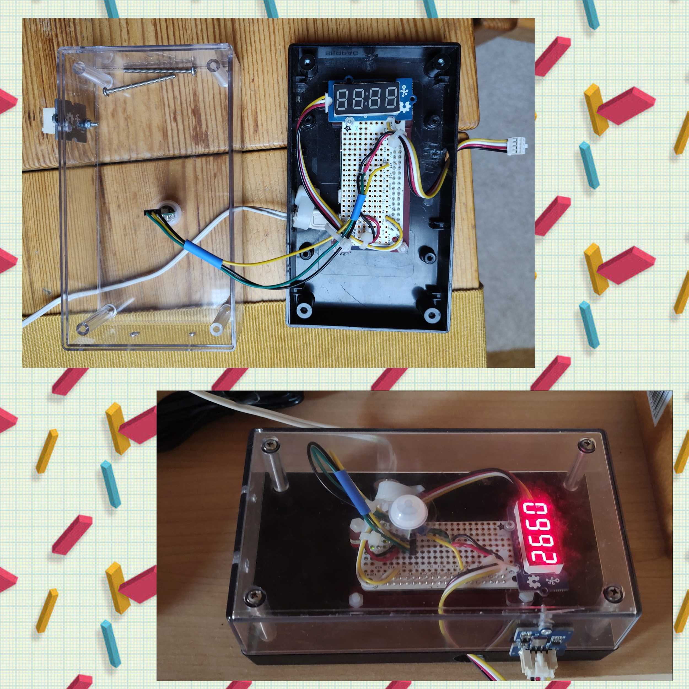

# grove_barometer
Temperature and pressure measurements using BMP085

This is intended to run on Raspberry Pi (any should work really).

Required hardware:
- [Seeedstudio Barometer Sensor](https://wiki.seeedstudio.com/Grove-Barometer_Sensor/) 
This may also work with other BMP085 based boards.  
This shall be connected to I2C. 
- [Seeedstudio 4-Digit Display](https://wiki.seeedstudio.com/Grove-4-Digit_Display/) 
This may also work with other TM1637 based boards.  
This shall be connected to some GPIO pins. Default setup of the script assumes 12 for CLK and 13 for DIO.

Required python libraries:
- [Adafruit_Python_BMP](https://github.com/adafruit/Adafruit_Python_BMP)
- [Seeedstudio Grove.py](https://github.com/Seeed-Studio/grove.py)

Then just run: 
`> sudo python3 barometer.py`

To setup systemd service please copy <i>barometer.service</i> file to appropriate directories and then enable and start this service.

For inspiration please see picture of my setup below:

